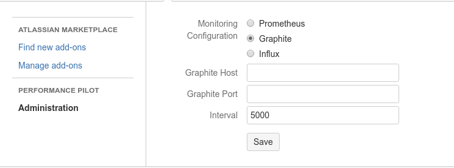
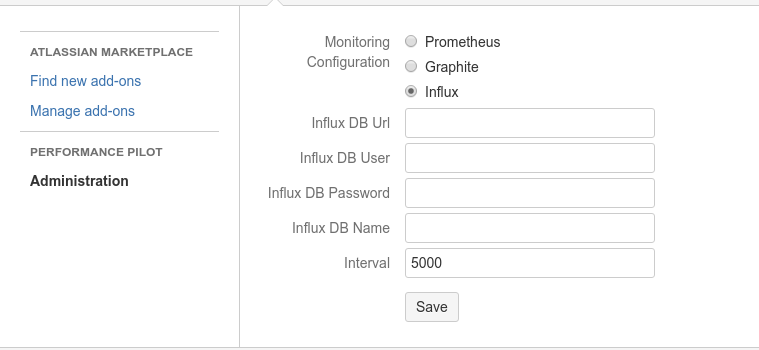

# Performance Pilot

## Overview
After installation the plugin you can add a license using the UPM ( Unified Plugin Management ) via all Atlassian Applications. It is always available at **<BASE_URL>/plugins/servlet/upm**

Within this view you can always go to the configuration page of the plugin with is available at 
**<BASE_URL>/plugins/servlet/mgit/performance-pilot/admin**. On certain Atlassian products ( Jira, Confluence, Bamboo ) there is also a menu item available within the plugins management view on the sidebar.

## Prometheus
### Configuration
The plugin was initialy developed to provide an inteface to Java metrics without relying on JMX for [prometheus](https://https://prometheus.io).
 

Within the configuration dialog you can also provide a token that must be send on the scrape configuration as parameter **token**. Because the scrape only happens on a GET method, the parameter must be passed as querystring parameter.

### Metrics
The metrics can be scrapped from following URI this URI is alos linked within the Configuration dialog.
***<BASE_URL>/plugins/servlet/mgit/performance-pilot/prometheus***
4 metric collectors are already defined via prometheus framework:
 * Memory Pools
 * Garbage Collector
 * Runtime
 * Threads

The custom metrics within the plugin are provided with a certain prefix. Details about those exporters are described on subpages.
 * [DataSources](DataSourcesExports.md), prefix: jdbc
 * [Connector](ConnectorExports.md), prefix: connector
 * [Protocol Handler](ProtocolHandlerExports.md), prefix: handler
 * [Atlassian](AtlassianExports.md), prefix: atlassian
 * [JMX](JMXExports.md), prefix: jmx

To provide support for other monitoring infrastructure we added Graphite and InfluxDB support on this plugin. The collection process of metrics is always the same routine, only the export or scrape of the metrics is different.

## Graphite

The metrics are sent in an interval of n miliseconds to graphite.
The default interval is 5000ms.

## Influx DB

The metrics are sent periodically to influx - this interval can also be configured within this dialog.
Influx has also a default of 5000ms. User an Password are optional parameters.
